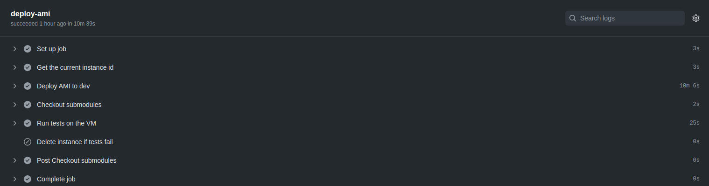

<h1 align="center">k8-go-infra</h1>

<p align="center">
    <a href="https://github.com/k8-proxy/go-k8s-infra/actions/workflows/build.yml">
        
    </a>
	<a href="https://github.com/k8-proxy/go-k8s-infra/pulls">
        
    </a>
    <a href="https://opensource.org/licenses/Apache-2.0">
        
    </a>
</p>


# go-k8-infra
Go based Kubernetes infrastructure, providing an ICAP based solution to process files through Glasswall CDR engine.

The work here is a continuation and enhancement over: https://github.com/k8-proxy/icap-infrastructure).

This repo uses rabbitmq-service-default-user secret which is created over : https://github.com/k8-proxy/icap-infrastructure

## Version v0.x:

### Solution diagram


### Enhancements

The solution provides the following enhancements:
- Using MinIO instead of local storage for the processing pods.
- Implementing process pods hot reload feature.


### Components
The solution consists of the following components:
- [Service 1](https://github.com/k8-proxy/go-k8s-srv)
- [Processing Service.](https://github.com/k8-proxy/go-k8s-process)
- [Controller Service.](https://github.com/k8-proxy/go-k8s-controller)
- Components related to ICAP server, RabbitMQ, transaction logs , Management UI and similar (From here: https://github.com/k8-proxy/icap-infrastructure).

### VM configuration needed for this setup to run smoothly

- 8 vCPU
- 32 GB RAM
- 50 GB Storage volume

On aws recommended instance type 
- t2.2xlarge

## Deployment Setup
- Install prerequisite 

```bash
sudo apt update
sudo apt-get install apt-transport-https ca-certificates curl gnupg-agent software-properties-common -y
sudo snap install yq
```

- Install Docker 

```bash
curl -fsSL https://download.docker.com/linux/ubuntu/gpg | sudo apt-key add -
sudo add-apt-repository "deb [arch=amd64] https://download.docker.com/linux/ubuntu $(lsb_release -cs) stable"
sudo apt-get update
sudo DEBIAN_FRONTEND=noninteractive apt-get install docker-ce docker-ce-cli containerd.io -y
```

- Install local docker registry

```bash
sudo docker run -d -p 127.0.0.1:30500:5000 --restart always --name registry registry:2
```

- Install k3s

```bash
curl -sfL https://get.k3s.io | sh -
mkdir -p ~/.kube && sudo install -T /etc/rancher/k3s/k3s.yaml ~/.kube/config -m 600 -o $USER
```
- Install kubectl
```bash
curl -LO "https://storage.googleapis.com/kubernetes-release/release/$(curl -s https://storage.googleapis.com/kubernetes-release/release/stable.txt)/bin/linux/amd64/kubectl"
chmod +x ./kubectl
sudo mv ./kubectl /usr/local/bin/kubectl
```

- Install helm

```bash
curl -sfL https://raw.githubusercontent.com/helm/helm/master/scripts/get-helm-3 | bash
```

- Deploy icap-server

```bash
git clone https://github.com/k8-proxy/icap-infrastructure.git -b k8-main && cd icap-infrastructure
```
```bash
# Clone ICAP SOW Version

git clone https://github.com/filetrust/icap-infrastructure.git -b main /tmp/icap-infrastructure-sow
cp  /tmp/icap-infrastructure-sow/adaptation/values.yaml adaptation/
cp  /tmp/icap-infrastructure-sow/administration/values.yaml administration/
cp  /tmp/icap-infrastructure-sow/ncfs/values.yaml ncfs/
```
- Create icap-adaptation namespace

```bash
kubectl create ns icap-adaptation
```

- Setup rabbitMQ

```bash
pushd rabbitmq && helm upgrade rabbitmq --install . --namespace icap-adaptation --set rabbitmqService.type=LoadBalancer,rabbitmqController.cpu=500m && popd
```

- Setup Icap-server

```bash
cat >> openssl.cnf <<EOF
[ req ]
prompt = no
distinguished_name = req_distinguished_name

[ req_distinguished_name ]
C = GB
ST = London
L = London
O = Glasswall
OU = IT
CN = icap-server
emailAddress = admin@glasswall.com
EOF
```

```bash
openssl req -newkey rsa:2048 -config openssl.cnf -nodes -keyout  /tmp/tls.key -x509 -days 365 -out /tmp/certificate.crt
```

```bash
kubectl create secret tls icap-service-tls-config --namespace icap-adaptation --key /tmp/tls.key --cert /tmp/certificate.crt
```

```bash
#PLEASE REPLACE PLACEHOLDERS
pushd adaptation

kubectl create -n icap-adaptation secret generic policyupdateservicesecret --from-literal=username=policy-management --from-literal=password='<TRANSACTIONS-PASSWORD>'

kubectl create -n icap-adaptation secret generic transactionqueryservicesecret --from-literal=username=query-service --from-literal=password='<TRANSACTIONS-PASSWORD>'

kubectl create -n icap-adaptation secret generic  rabbitmq-service-default-user --from-literal=username=guest --from-literal=password='<RABBITMQ-DEFAULT-PASSWORD>'

helm upgrade adaptation --values custom-values.yaml --install . --namespace icap-adaptation
popd
```

* Install minio

```bash
#PLEASE REPLACE PLACEHOLDERS
kubectl create ns minio

kubectl create ns jaeger

helm repo add minio https://helm.min.io/

helm install -n minio --set accessKey=minio,secretKey=<STRONG-PASSWORD>,buckets[0].name=sourcefiles,buckets[0].policy=none,buckets[0].purge=false,buckets[1].name=cleanfiles,buckets[1].policy=none,buckets[1].purge=false,fullnameOverride=minio-server,persistence.enabled=true,securityContext.enabled=false,persistence.size=20Gi,service.type=LoadBalancer minio/minio --generate-name

kubectl create -n icap-adaptation secret generic minio-credentials --from-literal=username='minio' --from-literal=password=<STRONG-PASSWORD>
```

* Deploy new Go services

```bash
cat >> get_sdk_version.sh <<'EOF'
#!/bin/bash

get_sdk_version() {
    repo_name=$1
    image_tag=$2
    sub_mod=$3
    branch_name=$4
    commit_sha=$(echo $image_tag | cut -d"-" -f2)
    folder_name=$(echo $repo_name | cut -d"/" -f2)
    git clone https://github.com/$repo_name --recursive --branch $branch_name -c submodule."sdk-rebuild-prod".update=none && pushd $folder_name && git checkout ${commit_sha}
    submodule_status=$(git submodule status)
    commit_msg=$(git log -1 --format=%s $sub_mod)
    sdk_version=$(echo $submodule_status | grep  "[0-9]*\.[0-9]*" -o || true)
    if [[ -z "$sdk_version" ]]; then
        sdk_version=$(echo $commit_msg | grep  "[0-9]*\.[0-9]*" -o || true)
    fi
    echo $sdk_version > /home/ubuntu/sdk_version.txt
    pushd $sub_mod
    last_updated_date=$(git log -1 --date iso --format=%cd libs/rebuild/linux/libglasswall.classic.so)
    echo $last_updated_date
    export last_updated_date=$(date -d"${last_updated_date}+30 days" "+%Y-%m-%d")
    echo $last_updated_date && popd
    echo "copied sdk version to file" && popd
    rm -rf $folder_name
}

EOF
```

```bash
chmod +x get_sdk_version.sh
source get_sdk_version.sh
```

```bash
git clone https://github.com/k8-proxy/go-k8s-infra.git -b main && pushd go-k8s-infra

requestImage=$(yq eval '.imagestore.process.tag' services/values.yaml)

get_sdk_version k8-proxy/go-k8s-process $requestImage sdk-rebuild-eval main
```

```BASH
# Scale the existing adaptation service to 0
kubectl -n icap-adaptation scale --replicas=0 deployment/adaptation-service
kubectl -n icap-adaptation delete cronjob pod-janitor

# Install jaeger-agent
kubectl apply -f jaeger-agent/jaeger.yaml

# Install k8s-dashboard
kubectl apply -f k8s-dash

# Apply helm chart to create the services
helm upgrade servicesv2 --install services --namespace icap-adaptation

popd
```

* Management User Interface (Optional)

```bash
# Admin ui default credentials
sudo mkdir -p /var/local/rancher/host/c/userstore
sudo cp -r default-user/* /var/local/rancher/host/c/userstore/
```
```bash
# Create namespaces
kubectl create ns management-ui
kubectl create ns icap-ncfs
```
```bash
# Setup icap policy management
# PLEASE REPLACE PLACEHOLDERS
pushd ncfs

kubectl create -n icap-ncfs secret generic ncfspolicyupdateservicesecret --from-literal=username=policy-update --from-literal=password='<TRANSACTIONS-PASSWORD>'

helm upgrade ncfs --values custom-values.yaml --install . --namespace icap-ncfs

popd
```
```BASH
# setup management ui
kubectl create -n management-ui secret generic transactionqueryserviceref --from-literal=username=query-service --from-literal=password='<TRANSACTIONS-PASSWORD>'

kubectl create -n management-ui secret generic policyupdateserviceref --from-literal=username=policy-management --from-literal=password='<TRANSACTIONS-PASSWORD>'

kubectl create -n management-ui secret generic ncfspolicyupdateserviceref --from-literal=username=policy-update --from-literal=password='<TRANSACTIONS-PASSWORD>'
```
```bash
pushd administration

helm upgrade administration --values custom-values.yaml --install . --namespace management-ui

popd
```
* Install cs-k8s-api (optional)

```bash
CS_API_IMAGE=${CS_API_IMAGE:-glasswallsolutions/cs-k8s-api:latest}

git clone https://github.com/k8-proxy/cs-k8s-api -b main && pushd cs-k8s-api

git fetch --tags --no-recurse-submodules

latest_github_sha=$(git rev-parse HEAD)

tag_name=$(git tag -l --contains $latest_github_sha | head -n 1)

echo "SDK version is $tag_name"

helm upgrade --install -n icap-adaptation rebuild-api --set application.api.env.SDKApiVersion="${tag_name}",resources.api.limits.cpu="1500m",resources.api.requests.cpu="1000m",resources.api.requests.memory="1000Mi",replicaCount="4"  --set application.api.env.SDKEngineInfo="EVAL" --set application.api.env.EvalExpiryDate="$last_updated_date" --set application.api.env.SDKEngineVersion=$(cat /home/ubuntu/sdk_version.txt ) infra/kubernetes/chart && popd

```

* Install Filedrop UI (optional)

```bash
git clone https://github.com/k8-proxy/k8-rebuild.git -b main && pushd k8-rebuild

# build images
rm -rf kubernetes/charts/sow-rest-api-0.1.0.tgz
rm -rf kubernetes/charts/nginx-8.2.0.tgz

# install helm charts
helm upgrade --install k8-rebuild -n icap-adaptation --set nginx.service.type=ClusterIP --atomic kubernetes/ && popd
```


## Services and Expose Port.

Make sure that the following ports are open accessible from the security group

<table>
<tr>
<td> Service Name </td>
<td> Port Number </td>
</tr>
<tr>
<td> RabbitMQ UI </td>
<td> 15672 </td>
</tr>
<tr>
<td> Minio </td>
<td> 9000 </td>
</tr>
<tr> 
<td> jaeger </td>
<td> 9001 </td>
</tr>
<tr>
<td> Proxy Rest Api </td>
<td> 80 </td>
</tr>
<tr>
<td> icap service </td>
<td> 1344 </td>
</tr>
<tr>
<td> Kubernetes Dashboard </td>
<td> 9090 </td>
</tr>
</table>
## Production Setup

* Latest ICAP AMI without DSK API : #TBD#

* Icap AMI with SDK API : #TBD#


- Login to aws console https://aws.amazon.com/console/
- Go to EC2 service.
- Choose Ireland, "eu-west-1" region
- Search for "AMI" under "Images" by entering the ami above
- Click on "Launch" button
- Select below configarature for next steps (available on bottom right corner):
        
    - Choose Instance Type      	   :     t2.2xlarge 
    - Configure Instance Details     :     The amount of requested instances 
    - Add Storage (disk space)        :     At least 50G
    - Add Tags                    	           :     Put the vm tags
    - Configure Security Group      :     Choose to select from existing groups, and select *launch-wizard-8*
- Once you verify above details, `LAUNCH` the instance. You will be prompt to enter privet key. Choose existing or create a new pem file.
- Wait untill the instance goes to running state
- Get the Public IP of the instance
- Access **Minio** on port **9000**.

    - 
    - Access Key:
    - Secret Key:
- Access **RabbitMQ** on port **15672**.

    - 
    - Username: guest
    - Password: 
- Access **Jaeger** on port **9001**.

    - 
- Access **K8Dash** on port **9090**. 

    - 
    - Access token:

        - Login to the server and run `kubectl get secrets`
        - Identify pod name that's named **skooner-sa-token-XXXXX** (where XXXXX part of the name changes)
        - run `kubectl describe secret skooner-sa-token-XXXXX`
        - copy the printed token and past it in k8dash UI to access it.
        - 


## How to Create AMI
### Workflow

- Create the ami is done by triggering the glasswall-rebuild workflows here https://github.com/k8-proxy/EAP-releases/actions

    - Run glasswall-rebuild-ck8s for compliant kubernetes based AMI
    - Run glasswall-rebuild-k3s for k3s based ami

- There are 2 main jobs for that workflow:
    - build-ami
        - Configure AWS credentials
        - Setup Packer
        - Build AMI 

    
    
    - deploy-ami
        - Get current instance ID
        - Deploy AMI to dev
        - Run tests on instance
        - Delete instance(s) that fail

    

### Execution

* Select the desired deployment workflow (k3s or ck8s)
* Manually trigger the workflow by pressing **Run workflow** and provide the following data:
  * Which branch to run this workflow from.
  * Icap infrastructure to use.
  * Which AWS regions where created AMI should be published.
  * Either to install filedrop UI & cs API on the AMI or not.
  * Either to create an OVA from the AMI or not.


* Once the run is done you will fine the AMI id in **build-ami** job at the end of **Build Eval OVA/AMI** logs


* And you can find the deployed instance ID and IP in **deploy-ami** job under **Deploy AMI to dev** logs


